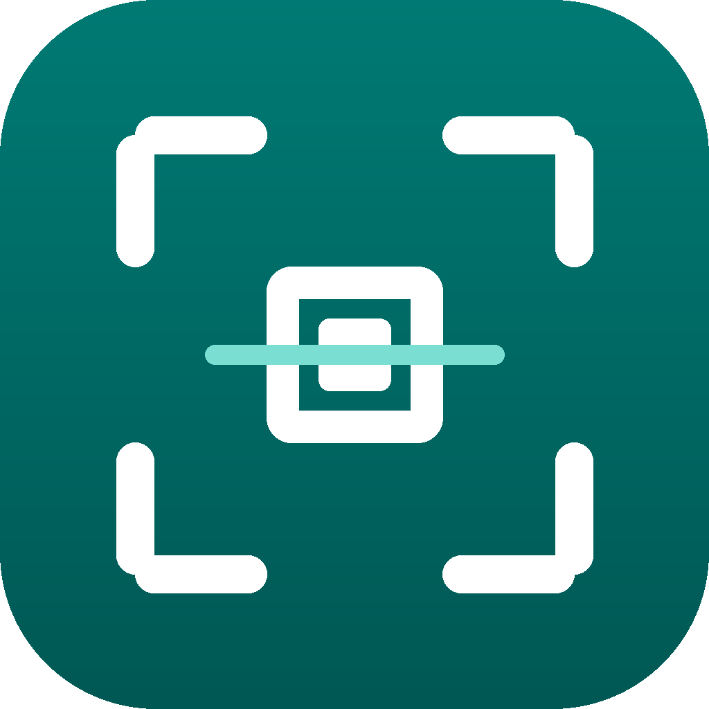
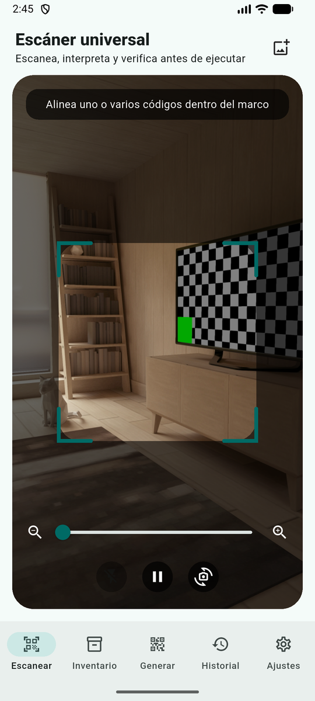
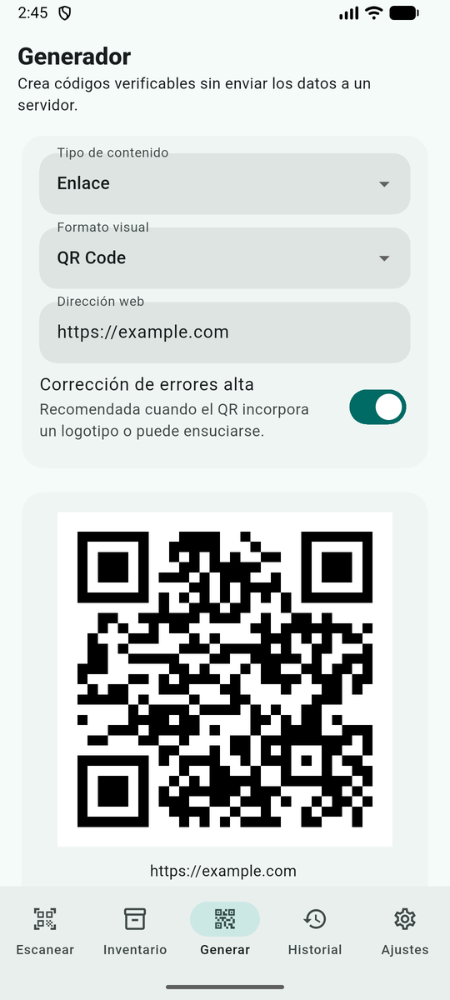
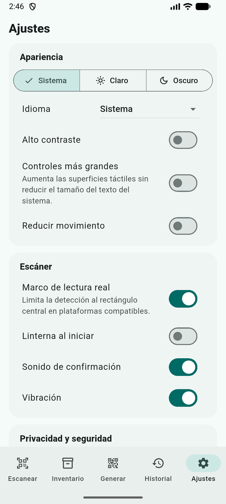
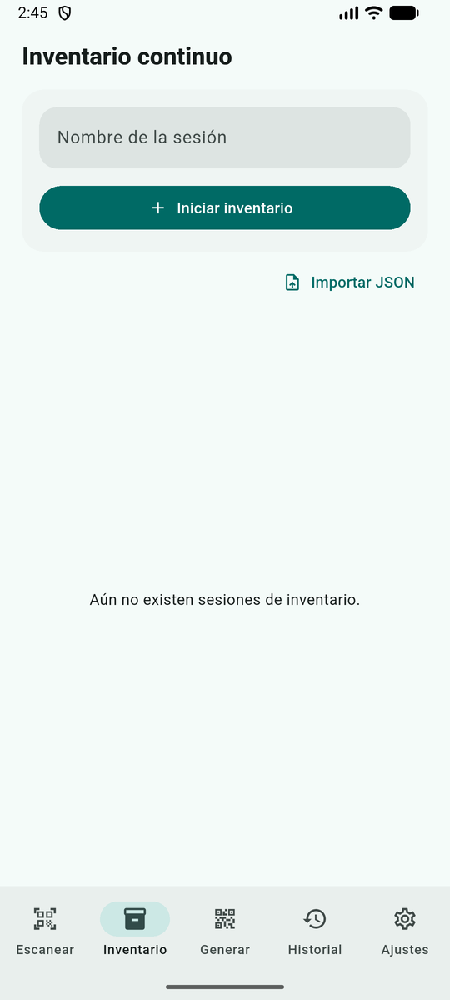
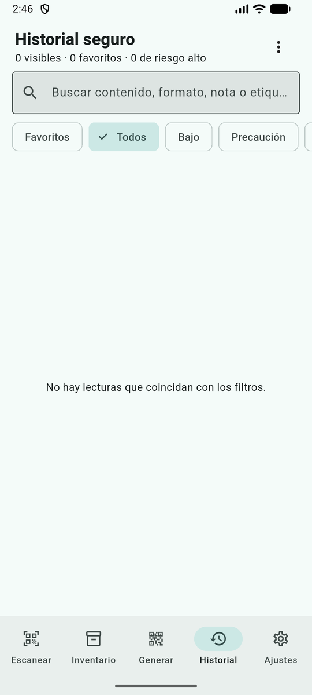
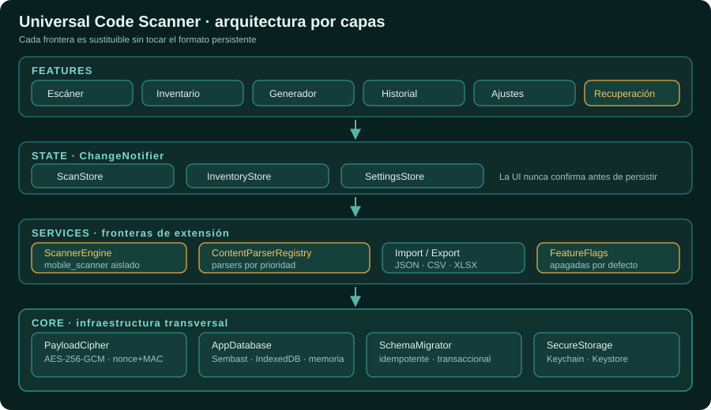
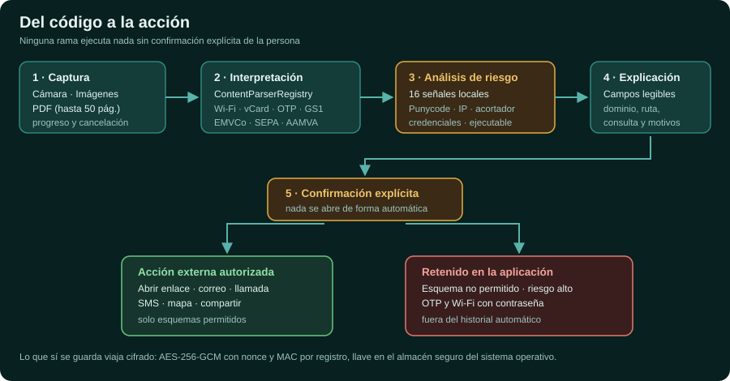

<p align="center">
  
</p>

# Universal Code Scanner

```text
╔═══════════════════════════════════════════════════════════════════════════════════╗
║                                                                                   ║
║  ██╗   ██╗███╗   ██╗██╗██╗   ██╗███████╗██████╗ ███████╗ █████╗ ██╗               ║
║  ██║   ██║████╗  ██║██║██║   ██║██╔════╝██╔══██╗██╔════╝██╔══██╗██║               ║
║  ██║   ██║██╔██╗ ██║██║╚██╗ ██╔╝█████╗  ██████╔╝███████╗███████║██║               ║
║  ██║   ██║██║╚██╗██║██║ ╚████╔╝ ██╔══╝  ██╔══██╗╚════██║██╔══██║██║               ║
║  ╚██████╔╝██║ ╚████║██║  ╚██╔╝  ███████╗██║  ██║███████║██║  ██║███████╗          ║
║   ╚═════╝ ╚═╝  ╚═══╝╚═╝   ╚═╝   ╚══════╝╚═╝  ╚═╝╚══════╝╚═╝  ╚═╝╚══════╝          ║
║                                                                                   ║
║                        C O D E   S C A N N E R                                    ║
║          Lector · intérprete · inventario · generador  ·  Flutter · v1.1.0        ║
╚═══════════════════════════════════════════════════════════════════════════════════╝
```

[](https://github.com/vladimiracunadev-create/universal-code-scanner/actions/workflows/flutter-ci.yml)
[](LICENSE)
[](.fvmrc)
[](#-plataformas)
[](CHANGELOG.md)
[](VALIDATION.md)
[](VALIDATION.md)
[](docs/PRIVACY_POLICY.md)

📲 **[Descargar APK para Android →](https://github.com/vladimiracunadev-create/universal-code-scanner/releases/latest)** · 📘 **[Arquitectura →](docs/ARCHITECTURE.md)** · 🔐 **[Seguridad →](docs/SECURITY.md)** · 🧾 **[Formatos →](docs/SUPPORTED_FORMATS.md)** · ✅ **[Validación real →](VALIDATION.md)**

---

**Universal Code Scanner es un lector de códigos que asume que un código puede
mentir.**

Un QR es una instrucción opaca: nadie puede leer a simple vista si lleva a un
banco o a una copia del banco. La mayoría de los lectores resuelve esa ambigüedad
abriendo el enlace de inmediato. Este proyecto hace lo contrario: **interpreta el
contenido, lo explica en campos legibles, evalúa 16 señales de riesgo locales y
espera una confirmación explícita antes de ejecutar cualquier acción externa.**

Todo ocurre en el dispositivo. **Sin cuentas, sin publicidad, sin analítica, sin
servidores propios.** El historial y los inventarios se cifran con AES-256-GCM
antes de tocar el disco, y la llave vive en el almacén seguro del sistema
operativo.

> **Interpretar primero. Actuar después.**

---

## 📱 Plataformas

| Plataforma | Estado en 1.1.0 | Notas |
|---|---|---|
| **Android** (API 24+) | **APK compilado y ejecutado** en emulador | Motor ML Kit vía `mobile_scanner` |
| **iOS** (15.5+) | Compila en CI (`--no-codesign`) | Motor Apple Vision · sin ejecución verificada |
| **macOS** | Compila en CI | Cámara y galería · sin ejecución verificada |
| **Web / PWA** | **Compila y se ejecuta** (release) | Sin lectura de PDF local |
| **Windows · Linux** | Vía PWA | Sin motor nativo en 1.1.0 |

Las carpetas nativas **no se versionan**: se generan de forma reproducible con
`tool/bootstrap.py`, que además aplica permisos, `minSdk`, entitlements,
descripciones de uso, la cadena de compilación de Gradle y los iconos. Así el
repositorio contiene únicamente fuente propia.

En pantallas anchas —navegador de escritorio o tablet— la interfaz se centra con
un ancho máximo de teléfono en lugar de estirarse de borde a borde.

---

## 📲 Instalar en Android

Los APK de cada versión están en
[Releases](https://github.com/vladimiracunadev-create/universal-code-scanner/releases/latest).
Descarga el que corresponda a tu teléfono:

| Archivo | Para quién | Tamaño aproximado |
|---|---|---|
| `app-arm64-v8a-release.apk` | **Prácticamente cualquier móvil actual** | ~32 MB |
| `app-armeabi-v7a-release.apk` | Móviles antiguos de 32 bits | ~30 MB |
| `app-x86_64-release.apk` | Emuladores y equipos x86 | ~34 MB |
| `app-release.apk` | Universal: funciona en todos, pesa el triple | ~92 MB |

Android pedirá permiso para instalar desde una fuente desconocida; es el flujo
normal de cualquier APK que no venga de una tienda. Cada archivo publica su
SHA-256 para que puedas verificar la descarga.

> [!IMPORTANT]
> Estos APK están firmados con la **clave de depuración** de Android
> (`CN=Android Debug`), porque 1.1.0 no incluye firma de publicación. Sirven
> para instalar y probar. **No** sirven para subir a Google Play, y una versión
> futura firmada con una clave propia no podrá actualizarlos: habrá que
> desinstalar antes.

---

## ⚡ Inicio rápido

Requiere **Flutter 3.44.7** (fijado en [`.fvmrc`](.fvmrc)) y Dart 3.12 o superior.

```bash
flutter pub get
```

```bash
python3 tool/bootstrap.py --platforms android,web
```

```bash
flutter analyze --fatal-infos && flutter test
```

```bash
flutter run
```

En Windows, `tool/bootstrap.ps1` cumple el mismo papel. La puerta de calidad
completa está en `tool/run_quality_gate.sh` y la de publicación en
`tool/finalize_stable.sh`.

---

## 🔍 Qué problema resuelve

| Pregunta | Cómo responde Universal Code Scanner |
|---|---|
| ¿A dónde lleva realmente este QR? | Muestra dominio, protocolo, ruta y consulta antes de abrir nada |
| ¿Este enlace intenta engañarme? | 16 señales locales: Punycode, alfabetos mezclados, credenciales en la URL, IP literal, acortador, descarga ejecutable… |
| ¿Qué dice este código que no es un enlace? | Interpreta Wi-Fi, vCard, eventos, OTP, GS1, ISBN, EMVCo, SEPA, Swiss QR, criptomonedas y AAMVA |
| ¿Puedo contar existencias con el teléfono? | Sesiones de inventario con conteo, notas y exportación a CSV/XLSX/JSON |
| ¿Y si el código está en un PDF o en fotos? | Lotes de hasta 20 imágenes y 50 páginas, con progreso y cancelación |
| ¿Queda mi historial expuesto? | Cifrado AES-256-GCM en disco; OTP y Wi-Fi con contraseña nunca se guardan solos |
| ¿Qué pasa si la base se corrompe? | Modo temporal en memoria + Centro de recuperación por registro |
| ¿Necesito generar un código? | Generador PNG/SVG de 10 simbologías |
| ¿Está escaneando ahora mismo? | Barra de estado permanente: solo se mueve mientras el motor analiza cuadros |

---

## 🎯 Cómo se comporta el escáner

La lectura es **automática**: no hay que pulsar nada para leer un código. Lo que
sí está siempre a la vista es en qué estado se encuentra la cámara, porque una
cámara que no arranca no puede parecerse a una cámara esperando un código.

| Estado | Qué se ve | Qué se ofrece |
|---|---|---|
| Iniciando cámara | Barra en movimiento | — |
| Escaneando | Barra en movimiento y línea que recorre el marco | Botón «Pausar» |
| Escaneo en pausa | Barra detenida y vista atenuada | «Reanudar escaneo», o tocar la vista |
| Cámara no disponible | Barra en color de error y motivo concreto | «Reintentar» y «Reiniciar cámara» |

Cada lectura conseguida suena con un **tono propio empaquetado en la
aplicación** —no con el efecto de sonido del sistema, que Android silencia en
cuanto se apagan los sonidos táctiles— y vibra. Sonido y vibración son dos
ajustes independientes, y con movimiento reducido activado la barra y el marco se
dibujan quietos.

Detalle por estado, causas del fallo corregido en 1.1.0 y comparación con las
convenciones de otros lectores en
[`docs/quality/SCANNER_UX.md`](docs/quality/SCANNER_UX.md).

---

## 📸 Capturas

La aplicación corriendo en el emulador oficial de Android (API 36), desde el APK
release compilado en este repositorio:

<p align="center">
  
  &nbsp;&nbsp;
  
  &nbsp;&nbsp;
  
</p>

<p align="center">
  
  &nbsp;&nbsp;
  
</p>

---

## 🏛️ Arquitectura

<p align="center">
  
</p>

El motor de cámara está aislado tras `ScannerEngine`, la interpretación tras
`ContentParserRegistry` y las capacidades futuras tras `FeatureFlags`. Ninguna
de esas fronteras conoce a las demás: se puede añadir un segundo motor o un
parser nuevo sin tocar el historial, el inventario ni el formato persistente.

```text
lib/
├── core/          infraestructura transversal (cifrado, base, recuperación, i18n)
├── models/        entidades inmutables y serializables
├── services/      interpretación, importación, exportación, plataforma
├── state/         stores basados en ChangeNotifier
└── features/      pantallas por caso de uso
```

Detalle completo en [`docs/ARCHITECTURE.md`](docs/ARCHITECTURE.md).

---

## 🔐 Del código a la acción

<p align="center">
  
</p>

Ninguna rama de este flujo abre un enlace, marca un teléfono ni conecta una red
sin que la persona lo confirme viendo antes los campos interpretados.

---

## 🧾 Formatos

| Categoría | Cobertura en 1.1.0 |
|---|---|
| **2D** | QR, Micro QR, Data Matrix, Aztec, PDF417, MaxiCode |
| **Lineales** | Code 128, Code 39, Code 93, Codabar, EAN-13, EAN-8, UPC-A, UPC-E, ITF |
| **GS1** | DataBar, DataBar Expanded, DataBar Limited, Application Identifiers |
| **Contenidos** | URL, texto, binario, Wi-Fi, vCard, MeCard, vEvent, correo, teléfono, SMS, geo, OTP, ISBN, producto |
| **Pagos** | EMVCo, EPC/SEPA, Swiss QR Bill, Bitcoin, Lightning, Ethereum |
| **Identidad** | AAMVA/PDF417 reconocible |
| **Generación** | QR, Data Matrix, Aztec, PDF417, Code 128, Code 39, EAN-13, EAN-8, UPC-A, GS1-128 |

La cobertura real de cada simbología depende del backend activo — ML Kit, Apple
Vision o el motor web. Detalle y exclusiones en
[`docs/SUPPORTED_FORMATS.md`](docs/SUPPORTED_FORMATS.md).

---

## 🛡️ Seguridad y privacidad

| Garantía | Implementación |
|---|---|
| Nada se abre solo | Confirmación explícita para cada acción externa |
| Historial cifrado | AES-256-GCM con nonce y MAC por registro |
| Llave protegida | Keychain / Keystore vía `flutter_secure_storage` |
| Llave ausente ≠ llave nueva | El descifrado falla, informa y bloquea escrituras con ese identificador |
| Rotación segura | Reencriptado completo dentro de una transacción; llave huérfana eliminada si falla |
| Secretos efímeros | OTP y Wi-Fi con contraseña fuera del historial; portapapeles con borrado programado |
| Diagnóstico sin datos | Solo tipo de error y huella de pila: nunca cargas, URLs ni notas |
| Telemetría | Cero. No hay red saliente propia |

Modelo de amenazas en [`docs/security/THREAT_MODEL.md`](docs/security/THREAT_MODEL.md)
y lista MASVS en [`docs/security/MASVS_CHECKLIST.md`](docs/security/MASVS_CHECKLIST.md).

---

## ✅ Calidad verificada

Ejecutado con Flutter 3.44.7 sobre esta misma versión del código:

| Comprobación | Resultado |
|---|---|
| `flutter pub get` | Resuelve — `pubspec.lock` versionado |
| `flutter analyze --fatal-infos` | **0 hallazgos** |
| `flutter test` | **57 de 57 en verde** |
| `flutter build web --release` | Compila |
| `python3 tool/validate_structure.py` | Sin errores estructurales |

Lo que **no** se ha verificado todavía está declarado sin adornos en
[`VALIDATION.md`](VALIDATION.md) y [`IMPLEMENTATION_STATUS.md`](IMPLEMENTATION_STATUS.md):
esta versión no ha sido probada en dispositivos físicos, y esa matriz vive en
[`docs/quality/DEVICE_TEST_MATRIX.md`](docs/quality/DEVICE_TEST_MATRIX.md).

---

## 📚 Documentación

| Documento | Contenido |
|---|---|
| [`docs/ARCHITECTURE.md`](docs/ARCHITECTURE.md) | Capas, flujo de lectura y puntos de extensión |
| [`docs/SUPPORTED_FORMATS.md`](docs/SUPPORTED_FORMATS.md) | Simbologías, contenidos y exclusiones |
| [`docs/SECURITY.md`](docs/SECURITY.md) | Modelo aplicado y señales de URL |
| [`docs/PRIVACY_POLICY.md`](docs/PRIVACY_POLICY.md) | Política de privacidad de referencia |
| [`docs/RELEASE.md`](docs/RELEASE.md) | Lista de publicación |
| [`docs/quality/SCANNER_UX.md`](docs/quality/SCANNER_UX.md) | Estados del escáner, causas del fallo de lectura y comparación con otros lectores |
| [`docs/quality/SCOPE_1_0.md`](docs/quality/SCOPE_1_0.md) | Alcance de 1.0.0 y verificación pendiente |
| [`docs/quality/COMPATIBILITY_CONTRACT.md`](docs/quality/COMPATIBILITY_CONTRACT.md) | Compromisos hacia versiones futuras |
| [`docs/quality/MIGRATIONS.md`](docs/quality/MIGRATIONS.md) | Esquema, sobres de cifrado y rotación |
| [`docs/quality/RECOVERY.md`](docs/quality/RECOVERY.md) | Centro de recuperación |
| [`docs/quality/ACCESSIBILITY.md`](docs/quality/ACCESSIBILITY.md) | Accesibilidad e idiomas |
| [`docs/quality/PERFORMANCE.md`](docs/quality/PERFORMANCE.md) | Límites, cancelación y trabajo fuera del hilo de UI |
| [`docs/quality/FEATURE_FLAGS.md`](docs/quality/FEATURE_FLAGS.md) | Capacidades apagadas por defecto |
| [`docs/quality/DEVICE_TEST_MATRIX.md`](docs/quality/DEVICE_TEST_MATRIX.md) | Matriz de pruebas en dispositivos |
| [`docs/quality/LOCKFILE.md`](docs/quality/LOCKFILE.md) | Política de bloqueo de dependencias |
| [`docs/security/THREAT_MODEL.md`](docs/security/THREAT_MODEL.md) | Modelo de amenazas |
| [`docs/security/MASVS_CHECKLIST.md`](docs/security/MASVS_CHECKLIST.md) | Lista MASVS |
| [`docs/security/SECURITY_TEST_PLAN.md`](docs/security/SECURITY_TEST_PLAN.md) | Plan de pruebas de seguridad |

---

## 🚧 Límites declarados de 1.1.0

Esta versión prefiere decir lo que no hace antes que insinuar que lo hace:

- **No hay firma de publicación ni tiendas.** Los APK publicados van firmados
  con la clave de depuración de Android: sirven para instalar y probar, no para
  Google Play. No se incluyen certificados propios, fichas, capturas
  comerciales, AAB ni IPA.
- **No hay pruebas en dispositivos físicos.** Cámara real, biometría, PDF
  grandes, TalkBack y VoiceOver siguen pendientes.
- **No hay motor nativo para Windows ni Linux.** Se cubren mediante la PWA.
- **No se promete compatibilidad** con códigos privados, cifrados o sin
  especificación pública.
- **El analizador no consulta reputación remota.** Solo muestra señales locales
  y nunca declara que un enlace sea seguro.
- **La interfaz está solo en español.** La infraestructura admite inglés y sus
  claves ya existen, pero el idioma no se expone hasta que todas las pantallas
  lean sus cadenas de `AppLocalizations`: media traducción se ve peor que
  ninguna.

---

## 📄 Licencia

[MIT](LICENSE) · © 2026 Vladimir Acuña
